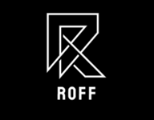

## Introduction
***
Roff is a webapp that integrate deep neural network machine learning model to forecast security prices based on financial report data. Roff is designed to be user-friendly and intuitive, with a clean and modern user interface. 
 
The application is built on top of the [Laravel PHP framework](https://laravel.com), and utilize [Laravel Breeze](https://laravel.com/docs/starter-kits#laravel-breeze) as authentication module.
 
Roff retrieves its data from [SimFin](https://github.com/SimFin/web-api-examples), and the DNN model requires its data as input to make predictions.

## Environment
***
To get this app to work, the necessary environment must be installed first. 
Roff requires 
<ol>
  <li>A local host webserver (e.g., XAMPP)</li>
  <li>Local python3 environment (with numpy, pandas, tensorflow)</li>
  <li>Composer</li>
  <li>Node.js</li>
  <li>SimFin Account</li>
  <li>An existing SMTP service</li>
</ol>

## Setup
***
After setting up the environment, follow the steps below:
<ol>
  <li>Copy your simfin api key, e.g., ROFF/app/Http/Controllers/StockController.php under store() and dashboard(), find them by searching <strong>"YOUR_API_KEY"</strong></li>
  <li><strong>Under the project directory</strong>, run
  
    composer install
    npm install
    php artisan key:generate
    npm run build

  </li>
  <li>To setup database, with your server on, run
  
    php artisan migrate

  </li>
  <li>Setup up your own STMP service and database connection in the generated .env file</li>
  <li>With python installed, remember to run pip install commands to install python modules:
  
    pip install numpy
    pip install pandas
    pip install tensorflow

  </li>
  <li>Github seems to keep making changes to the saved keras DNN model therefore to ensure the python model works, under Roff/public/roff_model/..., delete the <strong>roff_model</strong> folder. Then there is a zip file also named roff_model in the same folder, extract that folder and make sure its structures as such: <strong>Roff/public/roff_model/roff_model/assets</strong> 
  <li>To start the application, run:
  
    php artisan serve
  
  The webapp depend on your setups should be opened via: http://127.0.0.1:8000
  </li>
</ol>

## License
***
Roff is open-sourced software licensed under the MIT license.

